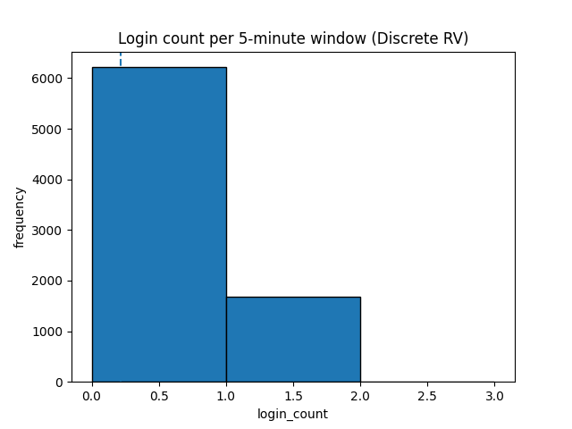
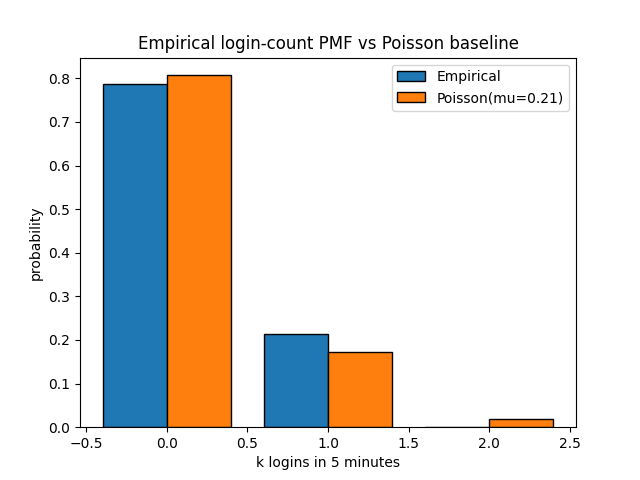
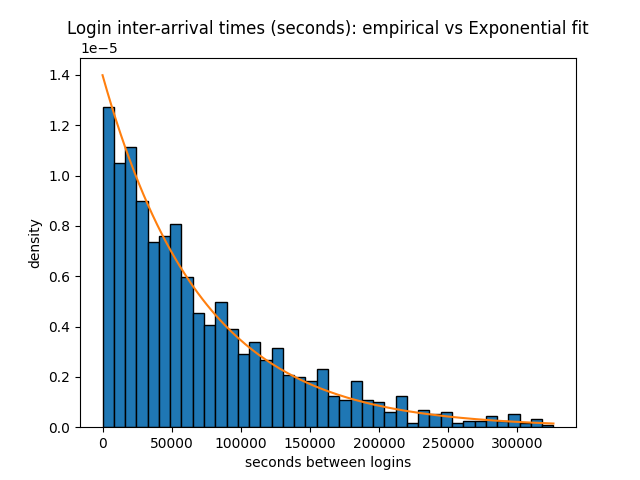
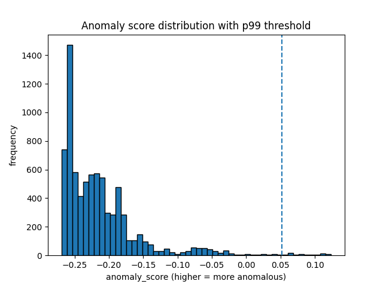
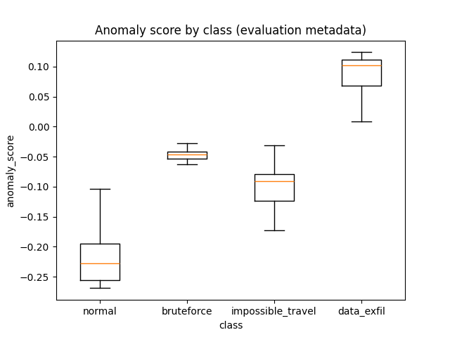

# Sentinel-ML: Security Log Anomaly Detection

## Overview
Sentinel-ML is a machine learning pipeline for detecting anomalies in security logs. It generates synthetic security event data, extracts meaningful features, trains an Isolation Forest model, and evaluates anomaly detection performance. The project is designed for educational and interview purposes, demonstrating practical approaches to cybersecurity analytics.

## Project Structure
```
requirements.txt
src/
  scripts/
    run_pipeline.py         # Main pipeline script
  sentinelml/
    config.py               # Configuration settings
    features.py             # Feature engineering
    log_generator.py        # Synthetic log generation
    model.py                # Model training and scoring
models/
  isoforest.joblib         # Saved trained model
notebooks/
  01_interview_stats.ipynb # Data exploration and visualization
reports/
data/
  raw/
    security_logs.jsonl     # Generated raw logs
  processed/
```

## Process & Workflow

### 1. Synthetic Log Generation
- **File:** src/sentinelml/log_generator.py
- Generates realistic security events for multiple users, including logins, file accesses, API calls, and injected anomalies (impossible travel, brute force, data exfiltration).
- Output: `data/raw/security_logs.jsonl` (JSONL format)

### 2. Feature Engineering
- **File:** src/sentinelml/features.py
- Aggregates events into per-user, per-5-minute windows.
- Extracts features such as event counts, login/fail rates, bytes transferred, geographic info, and more.
- Output: Feature table (X) and metadata (meta) for modeling and evaluation.

### 3. Model Training
- **File:** src/sentinelml/model.py
- Trains an Isolation Forest model using the feature table.
- The model is robust to outliers and well-suited for unsupervised anomaly detection.
- Model is saved to `models/isoforest.joblib`.

### 4. Scoring & Evaluation
- **File:** src/scripts/run_pipeline.py
- Loads the feature table and trained model.
- Computes anomaly scores for each window.
- Flags top 1% most anomalous windows as alerts (operational thresholding).
- Evaluates precision and hit-rate using injected anomaly labels.

### 5. Data Exploration & Visualization
- **File:** notebooks/01_interview_stats.ipynb
- Explores log statistics, feature distributions, and model results.
- Visualizes login count distributions, Poisson baselines, inter-arrival times, anomaly score distributions, and class-wise boxplots.


## Example Visualizations

Below are example visualizations generated by the pipeline and explored in the notebook. Each plot is accompanied by a brief explanation, mirroring the clarity and style of the notebook's markdown cells.

### Login Count Histogram
This plot shows the distribution of login events per user in each 5-minute window. The x-axis is the number of logins, and the y-axis is the frequency of those counts. The dashed line marks the average login count ($\hat{\lambda}$), which is used as a Poisson baseline for normal activity.



### Empirical vs Poisson PMF
This bar chart compares the empirical probability mass function (PMF) of login counts to the theoretical Poisson PMF using the observed mean. The left bars show the actual observed probabilities for each login count; the right bars show the expected probabilities if logins followed a Poisson process. This helps you see if login activity matches a typical random process or if there are deviations.



### Login Inter-arrival Times
This histogram shows the distribution of time gaps (in seconds) between consecutive logins for each user. The overlaid curve is the exponential probability density function (PDF) fitted to the mean gap. This visualization checks if login times are consistent with a memoryless (random) process, as expected in normal behavior.



### Anomaly Score Distribution
This histogram shows the distribution of anomaly scores assigned by your Isolation Forest model. The dashed line marks the threshold for the top 1% most anomalous scores (p99). This helps you visualize how rare or extreme the flagged anomalies are compared to the bulk of the data.



### Anomaly Score by Class
This boxplot compares anomaly scores across different event classes: normal, bruteforce, impossible_travel, and data_exfil. Each box shows the spread and median score for each class, letting you see which types of events are most anomalous according to your model. This is useful for evaluating how well your model distinguishes between normal and injected anomalies.




## Installation

1. Clone the repository and navigate to the project directory.
2. (Recommended) Create a virtual environment:
  ```bash
  python -m venv .venv
  source .venv/bin/activate  # On Windows: .venv\Scripts\activate
  ```
3. Install dependencies:
  ```bash
  pip install -r requirements.txt
  ```

## Usage Examples

**Run the full pipeline:**
```bash
$env:PYTHONPATH="src"
python -m src.scripts.run_pipeline
```

**Explore results in Jupyter Notebook:**
```bash
jupyter notebook notebooks/01_interview_stats.ipynb
```

## Troubleshooting

- **Feature mismatch error:** If you change features in `features.py`, delete `models/isoforest.joblib` and rerun the pipeline to retrain the model.
- **Missing files or folders:** Ensure you have run the pipeline at least once to generate data and model files.
- **Plots not showing in README:** Make sure to run all notebook cells to generate images in the `reports/` folder.

## Contributing

Contributions are welcome! Please open an issue or submit a pull request for bug fixes, improvements, or new features. For major changes, please discuss them in an issue first.

## References

- [Isolation Forest Paper](https://cs.nju.edu.cn/zhouzh/zhouzh.files/publication/icdm08b.pdf)
- [Scikit-learn IsolationForest Documentation](https://scikit-learn.org/stable/modules/generated/sklearn.ensemble.IsolationForest.html)
- [Poisson Process](https://en.wikipedia.org/wiki/Poisson_point_process)

## Contact

For questions, suggestions, or collaboration, please contact me at mjcolon218@gmail.com

## Key Concepts
- **Synthetic Data:** Enables controlled experiments and evaluation of anomaly detection methods.
- **Feature Engineering:** Aggregates raw logs into meaningful signals for modeling.
- **Isolation Forest:** Unsupervised algorithm for detecting rare, anomalous patterns.
- **Thresholding:** Operational approach to flagging alerts based on score percentiles.
- **Evaluation:** Uses injected anomalies to measure precision and hit-rate.

## Customization
- Adjust the number of events, anomaly rate, and seed in `run_pipeline.py` or `log_generator.py`.
- Add new features in `features.py` for richer modeling.
- Experiment with different models in `model.py`.

## License
This project is brought to you by Maurice J Colon.
